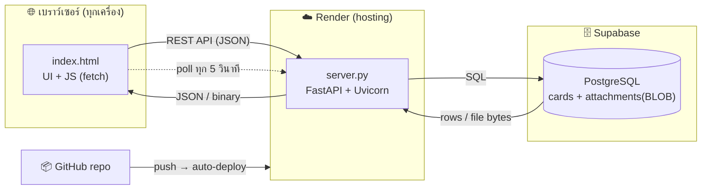
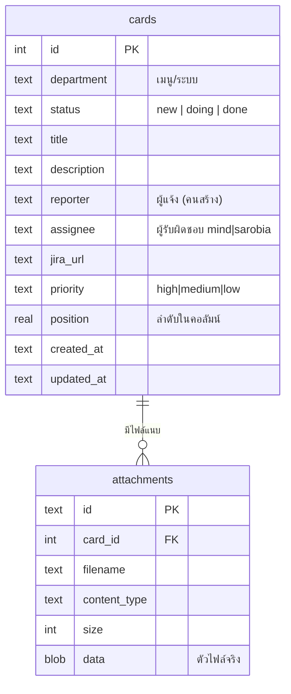
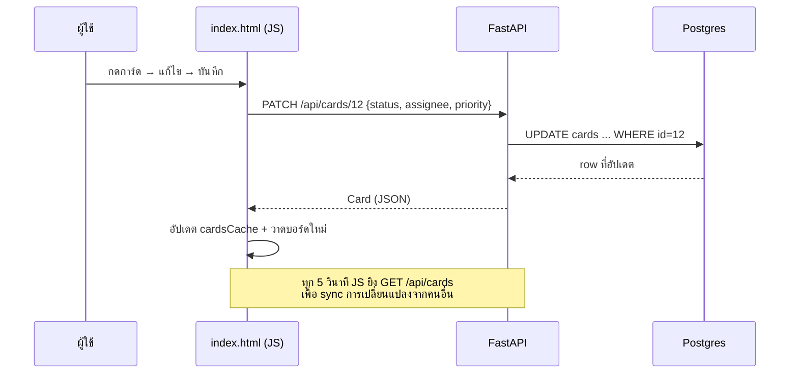

# สถาปัตยกรรมระบบ — PSF Issue Log

เอกสารสรุปโครงสร้างและการทำงานของระบบแจ้งปัญหาการใช้งาน (Trello-style issue board)

## 1. Tech Stack

| ส่วน | เทคโนโลยี | ไฟล์ |
|------|-----------|------|
| Frontend | HTML + CSS + JavaScript (vanilla, ไม่มี framework) | `index.html` |
| Backend | Python + FastAPI (รันด้วย Uvicorn) | `server.py` |
| ฐานข้อมูล | SQLite (local) / PostgreSQL (production) — สลับอัตโนมัติ | – |
| ไฟล์แนบ | เก็บเป็น BLOB ในฐานข้อมูล | – |
| Hosting | Render (แอป) + Supabase (Postgres) + GitHub (auto-deploy) | `Dockerfile`, `render.yaml` |

## 2. โครงสร้างไฟล์

```
psf-issue-log/
├── server.py         # Backend: FastAPI + ชั้นเชื่อม DB + REST API
├── index.html        # Frontend: UI + logic ทั้งหมดในไฟล์เดียว
├── requirements.txt  # fastapi, uvicorn, python-multipart, psycopg2-binary
├── Dockerfile        # image สำหรับ deploy
├── render.yaml       # Blueprint ของ Render
├── start.sh          # รันในเครื่อง (สร้าง venv + ติดตั้ง + รัน)
├── ARCHITECTURE.md   # เอกสารนี้
└── README.md         # คู่มือใช้งาน/ติดตั้ง/deploy
```

## 3. แผนภาพสถาปัตยกรรม



## 4. โครงสร้างฐานข้อมูล



## 5. REST API (8 ตัว + health + หน้าเว็บ)

ข้อมูลรับ/ส่งเป็น **JSON** (ยกเว้นอัปโหลดไฟล์ = multipart, โหลดไฟล์ = binary)

| Method | Path | หน้าที่ | Body ที่ส่ง | ผลลัพธ์ |
|--------|------|---------|-------------|---------|
| GET | `/api/cards` | ดึงการ์ดทั้งหมด | – | `[Card, ...]` (พร้อม attachments) |
| POST | `/api/cards` | สร้างการ์ด | `{department, status, title}` | `Card` |
| PATCH | `/api/cards/{id}` | แก้ไขการ์ด | `{title?, description?, status?, assignee?, priority?, jira_url?, reporter?, position?}` | `Card` |
| POST | `/api/cards/reorder` | จัดลำดับ/ย้าย (drag) | `[{id, status, position}, ...]` | `{ok:true}` |
| DELETE | `/api/cards/{id}` | ลบการ์ด (+ไฟล์แนบ) | – | `204` |
| POST | `/api/cards/{id}/attachments` | อัปโหลดไฟล์ (หลายไฟล์ได้) | multipart `files` | `[Attachment, ...]` |
| DELETE | `/api/attachments/{id}` | ลบไฟล์แนบ | – | `204` |
| GET | `/files/{id}` | โหลดไฟล์แนบจาก DB | – | ตัวไฟล์ (image/pdf/...) |
| GET | `/api/health` | เช็คสถานะ DB | – | `{backend, cards, ok}` |
| GET | `/` | ส่งหน้าเว็บ | – | `index.html` |

## 6. ลำดับการทำงาน (ตัวอย่าง: แก้ไขการ์ด)



## 7. กลยุทธ์การเก็บข้อมูล

- **สลับ DB อัตโนมัติ:** ถ้ามี env `DATABASE_URL` (ขึ้นต้น `postgres`) → ใช้ PostgreSQL ผ่าน `psycopg2`; ถ้าไม่มี → ใช้ SQLite ไฟล์ `data/issues.db` (สำหรับรันในเครื่อง)
- **ไฟล์แนบเก็บใน DB (BLOB):** ทำให้ย้าย/deploy ที่ไหน ข้อมูลตามไปครบ ไม่ต้องพึ่งดิสก์ถาวร (สำคัญเพราะ Render free ไม่มี disk ถาวร)
- **บีบอัดรูปก่อนเก็บ:** ฝั่ง frontend ย่อรูป (สูงสุด 1600px, JPEG คุณภาพ 0.72) ก่อนอัปโหลด → ประหยัดพื้นที่ DB มาก
- **จำกัดขนาดไฟล์:** 10 MB/ไฟล์ (ตั้งที่ `MAX_FILE_MB` ใน `server.py`)
- **ไม่มีระบบล็อกอิน:** ใครมีลิงก์ก็เข้าใช้ (เหมาะกับแชร์เฉพาะเจ้าหน้าที่)

## 8. รายละเอียดฝั่ง Frontend (`index.html`)

ทั้งหมดอยู่ใน IIFE เดียว แบ่งเป็นส่วน:
- **Config:** `DEPARTMENTS` (10 เมนู), `STATUSES` (3 สถานะ), `ASSIGNEES` (mind/sarobia), `PRIORITIES` (high/medium/low)
- **`api`:** ตัวห่อ `fetch` เรียก REST API
- **Render:** `renderSidebar`, `renderBoard`, `renderCardEl` (วาด UI จาก `cardsCache`)
- **Drag & Drop:** native HTML5 DnD + `commitReorder` (อัปเดตในที่โดยไม่ rebuild ทั้งบอร์ด = ลื่น ไม่กระพริบ)
- **Modal:** โหมด view/edit, ปุ่มบันทึก, อัปโหลด+บีบอัดไฟล์
- **Live sync:** `startPolling` ดึงข้อมูลใหม่ทุก 5 วินาที

## 9. การ deploy

```
แก้โค้ด → git push → GitHub → Render build+deploy อัตโนมัติ → ต่อ Supabase ผ่าน DATABASE_URL
```

ดูขั้นตอนตั้งค่า Render + Supabase แบบละเอียดใน [README.md](README.md)
